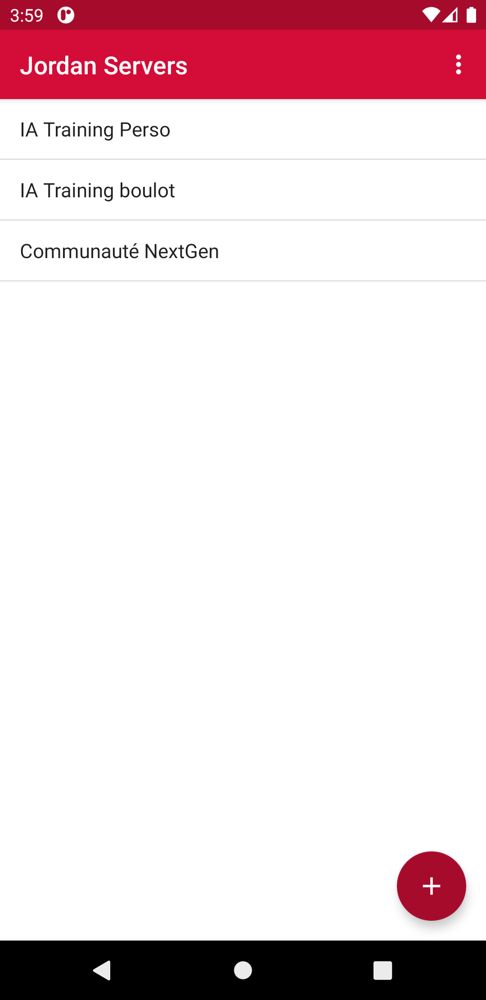
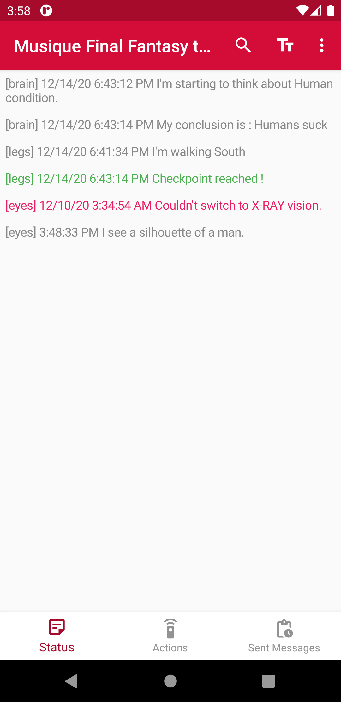
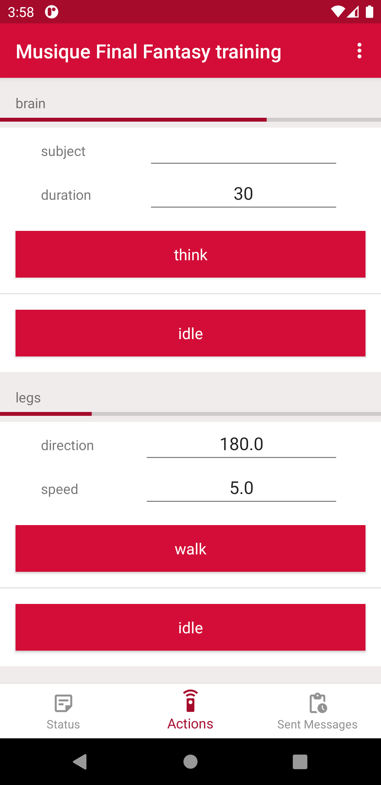
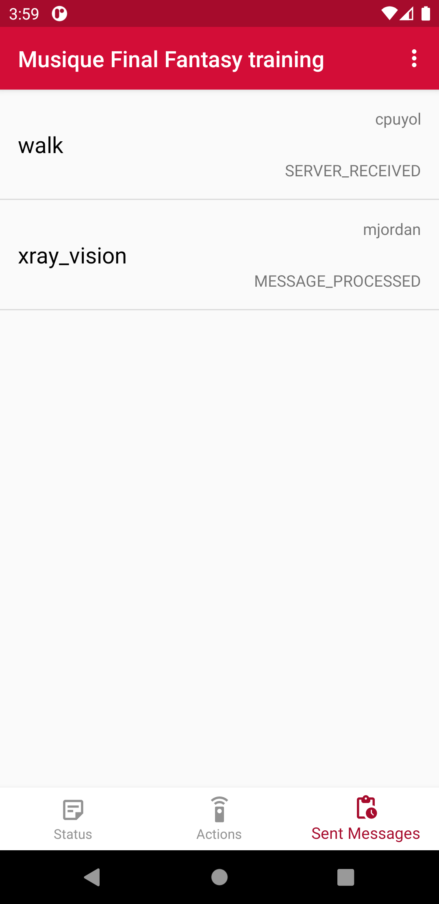

# Android App 
This Android app is a client to interact with programs having registered to a Jordan server.
In other words, with a few lines of code in any program (aiming long-time execution), this is :
- a generic GUI
- On your personal/professional Smartphone
- Anywhere (LAN/Internet), according to Jordan server access

## Jordan Server list
Add the base URI of a Jordan server API.

    

Here 3 servers are added and saved by the user.

## Jordan Client Interactions
A server may have one or several clients.
These clients are the executing program that has *register*ed.
User can interact with a client in different forms

### Status
Client (executing program) may send status.
The status purpose is definitely to let the user know how and where the execution is.
It may be considered as logs, dedicated to take actions from a Jordan User Interface (such as this Android app).

    

These statuses may help the user to decide if an action should be taken.

### Actions
This is the central part of Interactions in Jordan.
The user is able to send a message back to the client so the program may act in consequence.
The client define possible actions, when registering to the Jordan Server, 
and handle messages (an action executed by the user).

    

 
 ### Messages
 Eventually, here are the messages sent to the client.
 This is the feedback of your actions (and perhaps from other users).
 A state associated to each message tells where it is in the workflow, e.g :
 1. Server received
 2. Delivered to client
 3. Client acknowledges
 4. Message complete
 5. or in the contrary, Message failure
 
 

    

