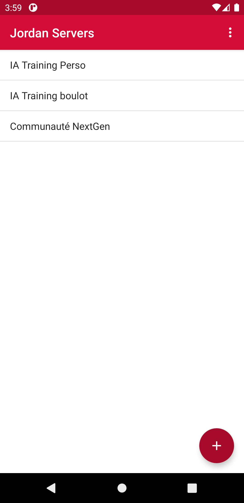
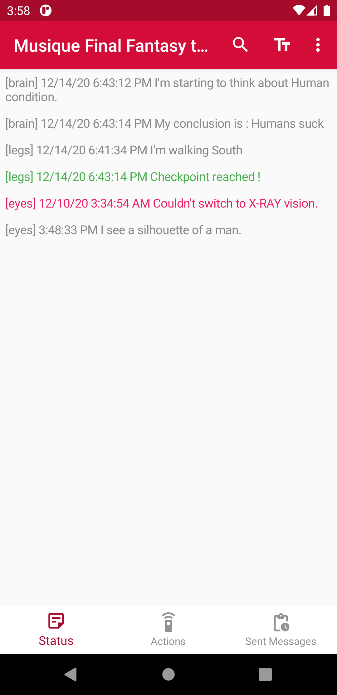
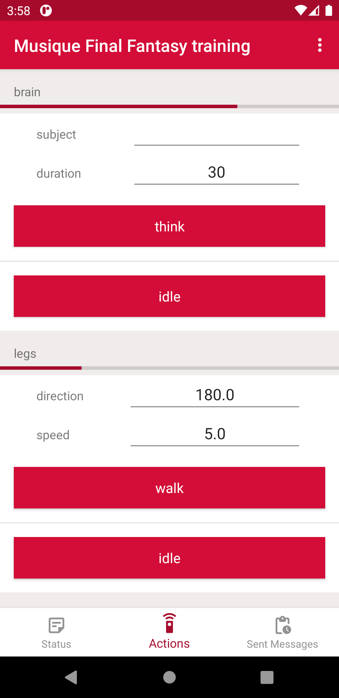
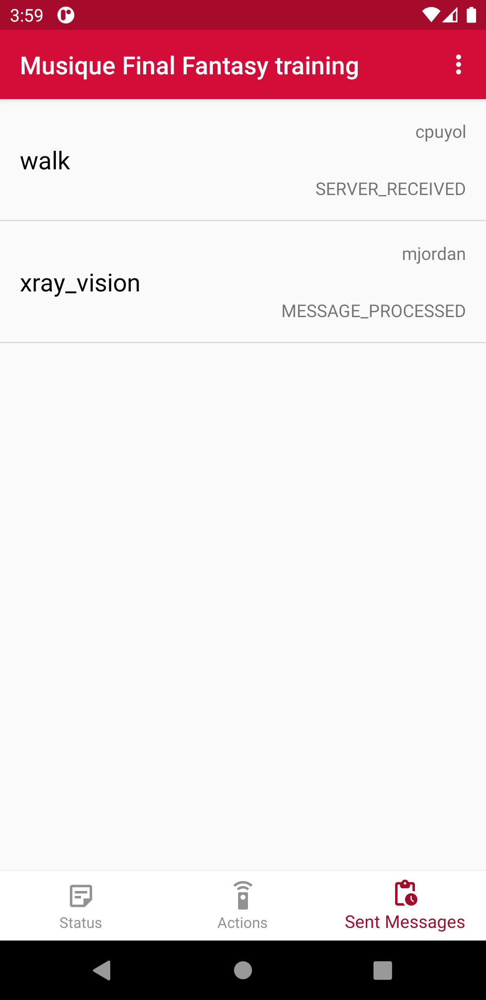

# Android App 
This Android app is a client to interact with programs having registered to a Jordan server.
In other words, with a few lines of code in any program (aiming long-time execution), this is :
- a generic GUI
- On your personal/professional Smartphone
- Anywhere (LAN/Internet), according to Jordan server access

## Jordan Server list
Add the base URI of a Jordan server API.

    

Here 3 servers are added and saved by the user.

## Authentication

The `/jordan/admin/*` endpoints the app calls require an operator session token.

- **Login** — the app exchanges a login and a password for a session token through
  `POST /jordan/admin/login`, and sends it as `Authorization: Bearer <token>` on every following
  call. One session per server: switching servers does not reuse a token.
- **Two separate dialogs** — *Server setup* declares a server (name, URL, and a « Try » button
  that checks it answers on `GET /hello`); the *Server login* dialog is the only place where
  credentials are typed, and the only one that actually verifies them.
- **Credentials** — ticking *Remember these credentials on this device* in the login dialog saves
  them for that server, which then opens its session on its own when you enter it. Unticking the
  box on the next login erases what was saved.
- **Where the password is kept** — the login goes to the server database, the password never
  does : it is encrypted with an AES key held by the Android Keystore, which never hands out the
  key itself, and the ciphertext is stored apart. A copied database, a device backup or an export
  of the server list therefore carries no password. Devices older than Android 6.0 have no such
  key : there the box is disabled rather than saving the password in clear.
- **On demand** — *Log in* / *Log out* are available in the overflow menu of the client screens.
- **When the server refuses a call** (`401`, no session or an expired one), the app asks for the
  credentials instead of showing a network error, and reloads the screen once logged in.
- **Roles** — a `403` means the operator role is too narrow for the action (`viewer` reads,
  `operator` also sends messages, `admin` also deletes). Logging in again does not widen it.

The session token lives in memory only: closing the app closes the session on this device.

## Jordan Client Interactions
A server may have one or several clients.
These clients are the executing program that has *register*ed.
User can interact with a client in different forms, one tab each at the bottom of the screen.
The tab opened stays opened when the device is rotated. Switching tabs is not a navigation step:
*Back* leaves the client, it does not walk through the tabs opened before.

### Status
Client (executing program) may send status.
The status purpose is definitely to let the user know how and where the execution is.
It may be considered as logs, dedicated to take actions from a Jordan User Interface (such as this Android app).

    

These statuses may help the user to decide if an action should be taken.

Two filters narrow a long list, and a status is displayed when it passes both:
- **the search of the toolbar** filters as you type, on a keyword;
- **the *Filter* dialog** applies when you press *Apply*: a text the status must contain, with the
  types and tasks to keep. Checking *Regular expression* reads the text as a pattern found anywhere
  in the status (`loss = 0\.[0-4]`, `^epoch \d+$`). Both the keyword and the pattern ignore case.

Patterns use [RE2 syntax](https://github.com/google/re2/wiki/Syntax), matched in a time linear in the
length of the status whatever the pattern: no backreferences (`\1`) and no lookarounds (`(?=…)`). An
invalid pattern keeps the dialog open with the reason, and the filters in place stay as they were.
The dialog's text is kept across refreshes, and shown again when the dialog reopens.

### Actions
This is the central part of Interactions in Jordan.
The user is able to send a message back to the client so the program may act in consequence.
The client define possible actions, when registering to the Jordan Server, 
and handle messages (an action executed by the user).

    

 
### Metrics
A client may also send named values — a loss per epoch, a throughput — as *metric* statuses. This
tab draws them as curves, one per metric name and task, and follows them while the program runs
(refreshed every 10 s by default while the tab is visible). Tapping a point shows its exact value,
its step and its time; pinch to zoom, drag to pan.

The *Chart settings* dialog chooses:
- **the metrics drawn** — one checkbox per name. A name sent for the first time is drawn;
- **the x axis** — *Step* (the epoch, the iteration the client attached to each value) or *Time*.
  *Step* is greyed out while one of the checked metrics holds a value sent without a step: that
  value would have no place on the axis. Unchecking that metric gives *Step* back;
- **auto-refresh** and its period.

These choices are kept while you stay on the client. The values also appear in *Status* as lines
of text.

 ### Messages
 Eventually, here are the messages sent to the client.
 This is the feedback of your actions (and perhaps from other users).
 A state associated to each message tells where it is in the workflow, e.g :
 1. Server received
 2. Delivered to client
 3. Client acknowledges
 4. Message complete
 5. or in the contrary, Message failure
 
 

    

## Tests

`./gradlew testDebugUnitTest` runs the unit tests on the JVM, which the CI runs on every pull
request touching the app. Those driving a screen through its lifecycle use Robolectric:
`ClientInteractionsFragmentTest` rotates the client screen and checks that the tab displayed, the
only one held, is the one its menu shows checked. The tabs live in the screen's child fragment
manager and read the model from it (`ClientInteractionsFragment.taskModelOf`): a field set by
`newInstance` would be lost when the system recreates the tab. `ReadStatusFragmentTest` drives the
*Filter* dialog of the Status tab the same way, on statuses served by a model that overrides
`readStatus` instead of calling a server.
`MainActivityInsetsTest` dispatches the insets of the system bars to the main screen and checks that
the toolbar starts below the status bar and the content stops above the navigation bar: from API 35
the app is drawn edge to edge, and `SystemBarInsets` is what keeps it clear of them (JRD-14).
