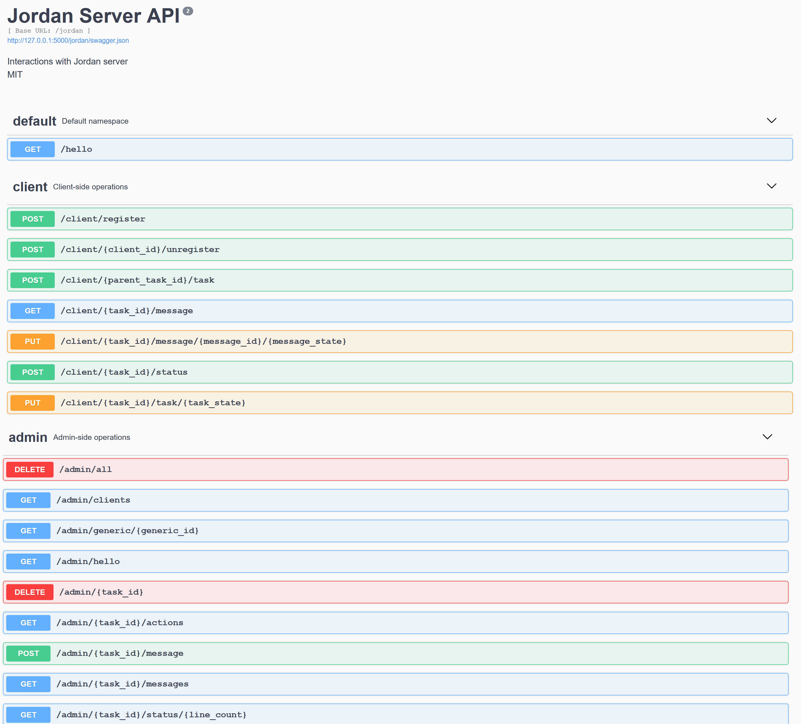

# How-to

## Prerequisite
- Have a supported backend running, such as Redis
- Select a backend implementation file. For example, for Redis-json implementation : 

    
    cd jordan-server/src
    cp backend_impl/rejson_interface.py jordan_backend.py
    cd ../..

For AWS Lambda :
- Have AWS CLI and SAM CLI installed and configured
- Deploy parameters and credentials

    cd create_secrets
    sam build ; sam deploy --guided
    cd ..

## Build
This steps creates Jordan Server Docker Image.

    cd jordan-server
    sam build -u -c

## Run locally
### Option A
As a simple Flask app : `python app.py`
Previous steps with *SAM* are useless with this option. 
On the contrary, you may want to set manually your credentials in environment variables. For example :
`JORDAN_BACKEND_HOST=redis-123.abc.east-us.azure.cloud.redislabs.com`
`JORDAN_BACKEND_PASSWORD=toto`.
You will be able to access Swagger UI on a web browser on an address like 
[http://localhost:5000/jordan/swagger-ui](http://localhost:5000/jordan/swagger-ui).

### Option B
As a AWS lambda container, exposed through a local AWS Gateway API : `sam local start-api --warm-containers LAZY`.
Notice port has changed : [http://localhost:3000/jordan/hello](http://localhost:3000/jordan/hello).

## AWS Lambda Deployment
Deploy Container and API for serverless usage with

    sam deploy --guided
    
Public address will be printed out.

# API
Below is a Swagger UI screenshot, which briefly describes API endpoints. 

    

# Appendix
List of supported backend (such as databases), and associated implementations :
- Redis :
    - rejson_interface.py
- Nothing :
    - mock.py
    
One may use interface `base_file.py` to start a new implementation.